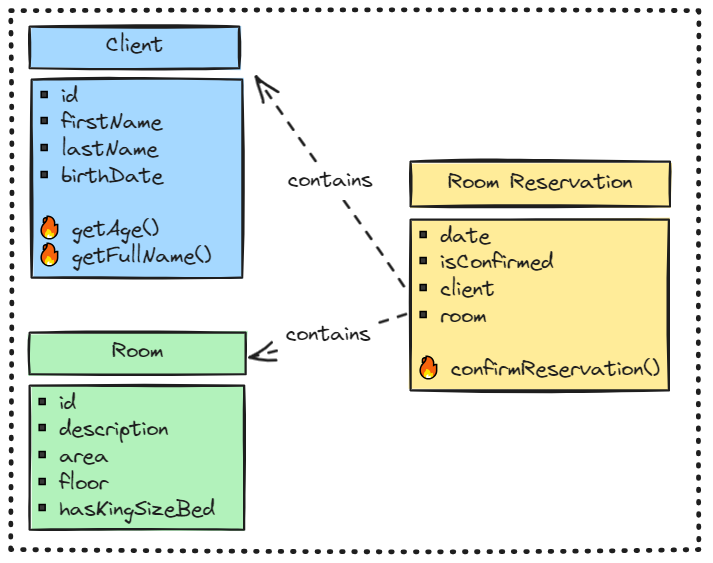
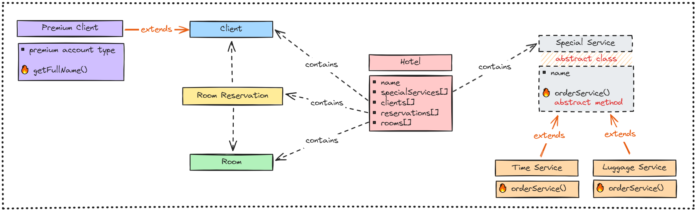
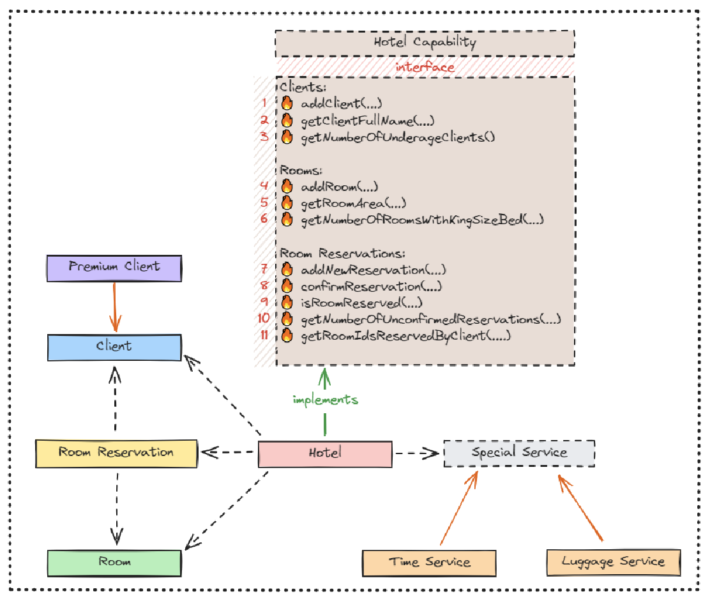

# OOP_DB_WSB

## TODO

### Zadanie 1.
Diagram:

- [x] Zaimplementowano klasy reprezentujące domenę biznesową przedstawioną na diagramie.
- [x] W każdej klasie zaimplementowano potrzebny konstruktor.
- [x] Każda klasa ma wszystkie wymagane pola pozwalające przechować wszystkie wymagane dane.
- [x] Każda klasa ma wymagane poprawnie zaimplementowane metody.
- [x] Demo.
- [x] Przesłanie zadania.

### Zadanie 2.
Diagram:

- [x] *poza poleceniem*: Przygotowanie `devcontainer`.
- [x] *poza poleceniem*: Dodanie `clang-format` i jego konfiguracji.
- [x] *poza poleceniem*: Dodanie wrapperów `make` dla ujednolicenia CLI.
- [x] Implementacja `class SpecialClient extends Client`.
- [x] Implementacja `abstract class SpecialService`.
- [x] Implementacja `class TimeService extends SpecialService`.
- [x] Implementacja `class LuggageService extends SpecialService`.
- [x] Implementacja dodatkowych metod `class TimeService` i `class LuggageService`
- [x] Implementacja `class Hotel` przechowującego kolekcje
- [x] *poza poleceniem*: implementacja metod `*.prettyPrint*()`.
- [x] Wykorzystanie odpowiednich kolekcji.
- [x] Wykorzystanie polimorfizmu.
- [x] Demo.
- [x] Przesłanie zadania.

### Zadanie 3.
Diagram:

- [ ] ~~*poza poleceniem*: Dodanie narzędzi do statycznej analizy kodu.~~
- [ ] ~~*poza poleceniem*: Wykorzystanie `lombok`.
  w celu zwiększenia czytelności i uniknięcia potencjalnych błędów potencjalnych błędów.~~
- [ ] ~~*poza poleceniem*: `*.prettyPrint*()` zmienić na `@Override .toString()`.~~
- [x] *poza poleceniem*: w `class Hotel` przechowywać dane w kolekcjach typu `key : value`,
  gdzie `key` to `id` dodawanego obiektu, najlepiej `add/get/remove` o `O(1)`,
  ułatwi to implementację logiki nowych metod z `interface HotelCapability`.
  - [x] rooms
  - [x] clients
  - [x] roomReservations
- [x] *poza poleceniem*: gettery do `Collection` powinny zwracać `Collections.unmodifiable*`
- [ ] ~~*poza poleceniem*: uniknąć rzucania unchecked wyjątków przy błędach argumentu wynikających
  ze złej (nieznalezionej) wartości, a nie błędu krytycznego~~
- [ ] ~~*poza poleceniem*: dodać logi błędów w miejscach, gdzie występuje błąd bez wyjątku~~
- [ ] ~~*poza poleceniem*: zdecydować jak handlować i dodać `null` handling do argumentów
  (szczególnie ID)~~
- [x] Dodanie (pliki jako załączniki w zadaniu) `class *Exception` do `pl.wsb.hotel.exceptions`.
  **Bez modyfikacji pliku (w tym pominięcie podczas formatowania)!**
- [x] Dodanie (plik jako załącznik w zadaniu) `interface HotelCapability` do `pl.wsb.hotel`.
  **Bez modyfikacji pliku (w tym pominięcie podczas formatowania)!**
- [x] Dodanie `String id` do `class RoomReservation`.
- [x] Implementacja `class Hotel implements HotelCapability`.
  - [x] `addClient(firstName, lastName, birthDate)` - tworzy nowego klienta, dodaje go do `Hotel`
    i zwraca jego `clientId`.
  - [x] `getClientFullName(clientId)` - zwraca pełne imię i nazwisko klienta o danym `clientId`.
  - [x] `getNumberOfUnderageClients()` - zwraca liczbę niepełnoletnich klientów.
  - [x] `addRoom(area, floor, hasKingSizeBed, description)` - jak `addClient()`.
  - [x] `getRoomArea(roomId)` - jak `getClientFullName(clientId)`.
  - [x] `getNumberOfRoomsWithKingSizeBed(floor)`-
    zwraca liczbę pokoi z łóżkiem king size na podanym piętrze.
  - [x] `addNewReservation(clientId, roomId, date)` - tworzy nową rezerwację
    dla istniejącego klienta o `clientId`
    i pokoju `roomId` na podaną datę `date` oraz zwraca `reservationId`.
    - [x] Jeśli klient o podanym `clientId` nie istnieje - `throw ClientNotFoundException`.
    - [x] Jeśli pokój o podanym `roomId` nie istnieje - `throw RoomNotFoundException`.
    - [x] Jeśli pokój o podanym `roomId` jest już zajęty tego dnia - `throw RoomReservedException`.
  - [x] `confirmReservation(reservationId)` - potwierdza rezerwację o danym `reservationId`
    i zwraca go.
    - [x] Jeśli rezerwacja o podanym `reservationId` nie istnieje -
      `throw ReservationNotFoundException`.
  - [x] `isRoomReserved(roomId, date)` - zwraca `boolean` czy pokój jest zarezerwowany danego dnia.
    - [x] Jeśli pokój o podanym `roomId` nie istnieje - `throw RoomNotFoundException`.
  - [x] `getNumberOfUnconfirmedReservations(date)` -
    zwraca liczbę niepotwierdzonych rezerwacji na podany dzień `date`.
  - [x] `getRoomIdsReservedByClient(clientId)` -
    zwraca kolekcję unikalnych (bez powtórzeń) `roomId` pokoi,
    które kiedykolwiek zostały zarezerwowane przez klienta o danym `clientId`.
- [x] Dodanie dependency wymaganych do unit testów do `pom.xml`.
- [x] Implementacja unit testów metod `class Hotel` z użyciem podejścia *given, when, then*.
  - [x] Implementacja metod `interface HotelCapability` związanych z `Client`
  - [x] Implementacja dodatkowych metod związanych z `Client`
  - [x] Implementacja metod `interface HotelCapability` związanych z `Room`
  - [x] Implementacja dodatkowych metod związanych z `Room`
  - [x] Implementacja metod `interface HotelCapability` związanych z `Reservation`
  - [x] Implementacja dodatkowych metod związanych z `Reservation`
  - [x] Implementacja dodatkowych metod związanych ze `SpecialService`
- [x] Implementacja unit testów pozostałych klas.
  (zgodnie z zasadami dobrego unit testowania nie testuje się DTOs - dopytać).
- [x] Pokrycie testów minimum 75%.
- [ ] ~~Demo.~~
- [ ] Przesłanie zadania.
